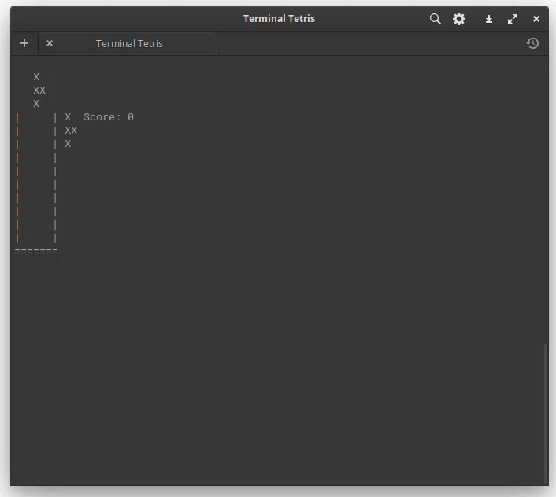

# Terminal Tetris

Simple game of Tetris in the Terminal

## How to install

The game is distributed as a .NET tool. See its listing at `nuget.org` here:
https://www.nuget.org/packages/TerminalTetris/

## How to contribute

If you have any ideas for next steps, feel free to [open an issue](https://github.com/matthew-matvei/TerminalTetris/issues/new).
PRs for feature enhancements / bug fixes are always welcome, though it would be best to discuss
them first to prevent your time being wasted.
